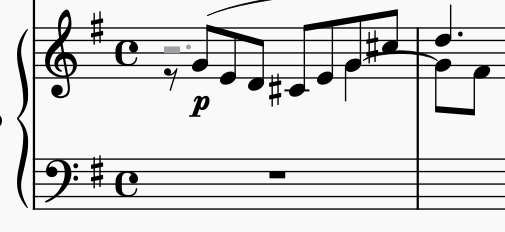

Sources of differences between my parses and music21:

- arpeggiated chords
- grace notes
- ornaments

Cases where we get a different answer from Mscore:

There are two voices that have a G on the 4th beat of m. 4:

- the upper voice has an eighth note
- the lower voice has a quarter note

If you inspect the musicxml file [add path?], you will discover that the tie is on the eighth-note in the upper voice. In this circumstance, where there are notes in different voices, separated by a gap, this parser doesn't impose a tie (it understands the tie in the upper voice to be dangling).

[Actually I changed the behavior so that it now performs a tie in this case.]
